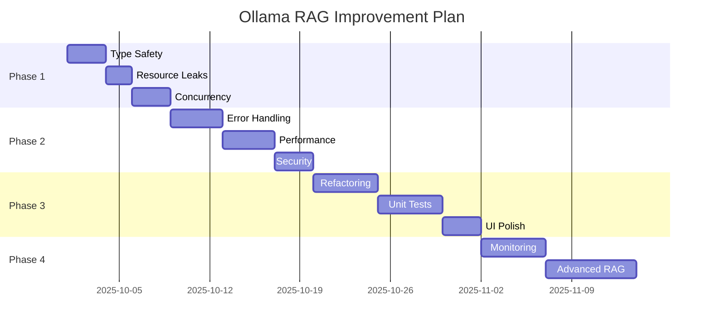

# 📊 BÁO CÁO ĐÁNH GIÁ TOÀN DIỆN - OLLAMA RAG APP
**Ngày đánh giá:** 2025-10-01
**Người đánh giá:** AI Agent (Warp Terminal)
**Phiên bản Python:** 3.12.10
**Tổng số files:** 85 files (~295KB code)

---

## 🎯 TÓM TẮT TỔNG QUAN

### ✅ ĐIỂM MẠNH (Strengths)
1. **Kiến trúc rõ ràng và modular** 💎
   - Backend FastAPI tách biệt module (app/)
   - Frontend web đơn giản nhưng đầy đủ (web/)
   - Desktop shell độc lập (desktop/)
   - Separation of concerns tốt

2. **Tính năng phong phú** 🚀
   - Multi-DB support với isolation tốt
   - Hybrid Search (Vector + BM25 + RRF)
   - Reranker với BGE ONNX + fallback
   - Multi-hop retrieval với budget control
   - Query rewrite cho đa dạng hóa
   - Chat sessions với auto-save
   - Provider switch (Ollama/OpenAI)
   - Citations tracking đầy đủ
   - Analytics và logging chi tiết
   - Feedback system
   - Offline evaluation

3. **Testing coverage ấn tượng** ✨
   - 21 test files e2e Playwright
   - Coverage: basic, advanced, UI, API
   - Test modes: light và heavy
   - Global setup/teardown tốt

4. **Documentation xuất sắc** 📚
   - README.md rất chi tiết
   - WARP.md theo dõi tiến trình
   - .env.example đầy đủ
   - Inline comments hợp lý
   - Deploy guides (Docker + Cloudflare)

5. **Production-ready features** 🏆
   - Retry + backoff cho Ollama
   - Generation cache với TTL
   - Error handling cơ bản tốt
   - Multi-format ingest (txt/pdf/docx)
   - Language detection (langid)
   - Version tracking

---

## ⚠️ VẤN ĐỀ PHÁT HIỆN (Issues Found)

### 🔴 CRITICAL (Ưu tiên cao nhất)

#### 1. **Type Safety và Validation thiếu sót**
**Location:** `app/main.py`, `app/rag_engine.py`
**Issues:**
- Không dùng strict typing (missing TypedDict, Protocol)
- Input validation yếu ở các endpoints
- Có thể inject malicious paths qua `/api/ingest`
- Missing request body size limits

**Impact:** 🔥🔥🔥 High - Có thể gây crash hoặc security breach
**Fix Priority:** 1

#### 2. **Resource Leaks tiềm ẩn**
**Location:** `app/rag_engine.py` (FAISS, SQLite connections)
**Issues:**
```python
# Line 212-213: SQLite connection không đóng khi exception
self._faiss_map_conn = _sqlite3.connect(self._faiss_map_path())
# Không có context manager hoặc try-finally
```
**Impact:** 🔥🔥 Medium-High - Memory leak trong long-running app
**Fix Priority:** 2

#### 3. **Concurrency Issues**
**Location:** `app/rag_engine.py`, `app/chat_store.py`
**Issues:**
- BM25 state (_bm25_docs, _bm25_metas) không thread-safe
- File I/O trong chat_store không lock
- Race condition khi concurrent ingest + query

**Impact:** 🔥🔥 Medium - Data corruption khi multi-user
**Fix Priority:** 2

---

### 🟡 IMPORTANT (Quan trọng)

#### 4. **Error Handling không đồng nhất**
**Location:** Nhiều files trong `app/`
**Issues:**
- Catch `Exception` quá rộng (anti-pattern)
- Một số lỗi bị silence (pass in except)
- Không log chi tiết errors
- HTTP exceptions không có error codes chuẩn

**Example:**
```python
# app/rag_engine.py:93-94
except Exception:
    return ""  # Mất thông tin lỗi!
```
**Impact:** 🔥 Medium - Khó debug khi production
**Fix Priority:** 3

#### 5. **Performance Bottlenecks**
**Location:** `app/rag_engine.py`
**Issues:**
- `_build_bm25_from_collection()` load toàn bộ docs vào RAM
- Không cache filters (`get_filters()`)
- Reranker không batch tối ưu mặc định
- Multi-hop không giới hạn tổng tokens

**Impact:** 🔥 Medium - Chậm với large datasets
**Fix Priority:** 4

#### 6. **Security Concerns**
**Location:** `app/main.py`, `app/openai_client.py`
**Issues:**
- API keys có thể leak qua logs
- No rate limiting trên endpoints
- CORS không config (mặc định allow all?)
- File upload không validate content (chỉ extension)
- Path traversal risk trong `ingest_paths`

**Impact:** 🔥 Medium - Security vulnerabilities
**Fix Priority:** 3

---

### 🟢 NICE-TO-HAVE (Cải thiện)

#### 7. **Code Quality**
- Một số functions quá dài (>100 lines)
- Magic numbers chưa define constants
- Thiếu docstrings ở nhiều functions
- Type hints không đầy đủ

#### 8. **Testing Gaps**
- Không có unit tests (chỉ e2e)
- Mock coverage chưa đủ
- Edge cases chưa test (empty DB, large files)
- Performance tests thiếu

#### 9. **UI/UX**
- Không có loading indicators
- Error messages chưa user-friendly
- Mobile responsive chưa tốt
- Accessibility (a11y) thiếu

#### 10. **Dependencies**
- Numpy pinned < 2 (chromadb constraint) - cần monitor update
- Không có dependabot/security scanning
- Requirements.txt chưa pin versions đầy đủ

---

## 📋 PLAN CẢI THIỆN CHI TIẾT

### 🎯 Phase 1: CRITICAL FIXES (Tuần 1-2)

#### Task 1.1: Type Safety & Validation 🛡️
**Mục tiêu:** Tăng độ ổn định và tránh crashes

**Công việc:**
1. Thêm Pydantic models cho tất cả API requests/responses
2. Validate file paths với `pathlib.Path().resolve()` để tránh traversal
3. Add request size limits qua middleware
4. Enable FastAPI's built-in validation

**Files cần sửa:**
- `app/main.py`: Thêm request validators
- `app/rag_engine.py`: Validate DB names, paths

**Code Example:**
```python
from pathlib import Path
from pydantic import validator, field_validator

class IngestRequest(BaseModel):
    paths: List[str] = ["data/docs"]
    db: Optional[str] = None
    version: Optional[str] = None

    @field_validator('paths')
    def validate_paths(cls, v):
        for p in v:
            # Chặn path traversal
            resolved = Path(p).resolve()
            if not str(resolved).startswith(str(Path.cwd())):
                raise ValueError(f"Invalid path: {p}")
        return v
```

**Testing:** Tạo `tests/unit/test_validation.py`

---

#### Task 1.2: Fix Resource Leaks 💧
**Mục tiêu:** Prevent memory leaks

**Công việc:**
1. Wrap SQLite connection trong context manager
2. Add cleanup methods và `__del__` cho RagEngine
3. Close file handles trong chat_store

**Code Example:**
```python
import contextlib

@contextlib.contextmanager
def _faiss_connection(self):
    """Context manager cho FAISS map connection"""
    conn = _sqlite3.connect(self._faiss_map_path())
    try:
        yield conn
    finally:
        conn.close()

# Usage
with self._faiss_connection() as conn:
    cur = conn.cursor()
    # ... operations
```

**Testing:** Memory profiling với `memory_profiler`

---

#### Task 1.3: Concurrency Safety 🔒
**Mục tiêu:** Thread-safe operations

**Công việc:**
1. Add `threading.Lock` cho BM25 state
2. Use `filelock` cho chat_store file I/O
3. Test với concurrent requests

**Dependencies:**
```bash
pip install filelock
```

**Code Example:**
```python
import threading

class RagEngine:
    def __init__(self, ...):
        # ...
        self._bm25_lock = threading.Lock()

    def _build_bm25_from_collection(self):
        with self._bm25_lock:
            # ... build BM25
```

**Testing:** `tests/e2e/concurrency.spec.js` với parallel requests

---

### 🎯 Phase 2: IMPORTANT IMPROVEMENTS (Tuần 3-4)

#### Task 2.1: Error Handling Standards 📝
**Mục tiêu:** Consistent error handling

**Công việc:**
1. Tạo custom exception classes
2. Replace generic `except Exception` với specific exceptions
3. Add structured logging với `structlog`
4. Error response format chuẩn

**Code Example:**
```python
# app/exceptions.py (NEW FILE)
class OllamaRAGException(Exception):
    """Base exception"""
    pass

class IngestError(OllamaRAGException):
    """Lỗi khi ingest tài liệu"""
    pass

class RetrievalError(OllamaRAGException):
    """Lỗi khi retrieve"""
    pass

# Usage trong rag_engine.py
try:
    text = extract_text_from_pdf(path)
except PyPDFError as e:
    logger.error(f"PDF extraction failed: {path}", exc_info=e)
    raise IngestError(f"Cannot extract PDF: {path}") from e
```

**Testing:** Assert correct exception types

---

#### Task 2.2: Performance Optimization 🚀
**Mục tiêu:** Faster response times

**Công việc:**
1. Cache filters results (TTL 5 mins)
2. Lazy load BM25 (chỉ build khi cần)
3. Add pagination cho large result sets
4. Batch reranker mặc định = 32

**Code Example:**
```python
from functools import lru_cache
from datetime import datetime, timedelta

class RagEngine:
    def __init__(self, ...):
        self._filters_cache_time = None
        self._filters_cache_ttl = 300  # 5 mins

    def get_filters(self):
        now = datetime.now()
        if (self._filters_cache_time and
            (now - self._filters_cache_time).seconds < self._filters_cache_ttl):
            return self._filters_cache

        # Rebuild cache
        # ...
        self._filters_cache_time = now
        return result
```

**Testing:** Benchmark với `pytest-benchmark`

---

#### Task 2.3: Security Hardening 🔐
**Mục tiêu:** Production-grade security

**Công việc:**
1. Add rate limiting với `slowapi`
2. Sanitize API keys trong logs
3. Content-type validation cho uploads
4. CORS config rõ ràng
5. Add security headers

**Dependencies:**
```bash
pip install slowapi python-magic
```

**Code Example:**
```python
from slowapi import Limiter, _rate_limit_exceeded_handler
from slowapi.util import get_remote_address

limiter = Limiter(key_func=get_remote_address)
app.state.limiter = limiter

@app.post("/api/query")
@limiter.limit("10/minute")  # Max 10 queries/min per IP
async def api_query(req: QueryRequest):
    # ...
```

**Testing:** Security scan với `bandit`, `safety`

---

### 🎯 Phase 3: CODE QUALITY (Tuần 5)

#### Task 3.1: Refactoring 🔨
**Mục tiêu:** Clean, maintainable code

**Công việc:**
1. Extract large functions (>80 lines) thành smaller helpers
2. Define constants module (`app/constants.py`)
3. Add comprehensive docstrings
4. Type hints đầy đủ với `mypy`

**Example:**
```python
# app/constants.py (NEW FILE)
"""Application constants và configuration defaults."""

# Chunking
DEFAULT_CHUNK_SIZE = 800
DEFAULT_CHUNK_OVERLAP = 120

# Retrieval
DEFAULT_TOP_K = 5
MAX_TOP_K = 50

# RRF
RRF_K_DEFAULT = 60

# Timeouts (seconds)
OLLAMA_CONNECT_TIMEOUT = 5
OLLAMA_READ_TIMEOUT = 180
```

**Testing:** Run `mypy` strict mode

---

#### Task 3.2: Unit Tests 🧪
**Mục tiêu:** Better test coverage

**Công việc:**
1. Tạo `tests/unit/` structure
2. Test individual functions với mocks
3. Target 80%+ coverage

**Structure:**
```
tests/
├── unit/
│   ├── test_rag_engine.py
│   ├── test_chat_store.py
│   ├── test_reranker.py
│   ├── test_validation.py
│   └── test_utils.py
└── e2e/
    └── (existing tests)
```

**Run:**
```bash
pytest tests/unit/ --cov=app --cov-report=html
```

---

#### Task 3.3: UI/UX Polish ✨
**Mục tiêu:** Better user experience

**Công việc:**
1. Add loading spinners với CSS animations
2. Toast notifications cho success/error
3. Responsive design improvements
4. Keyboard shortcuts

**Files:**
- `web/styles.css`: Add modern components
- `web/app.js`: Toast notifications, loading states

**Example:**
```javascript
// Toast notification helper
function showToast(message, type = 'info') {
    const toast = document.createElement('div');
    toast.className = `toast toast-${type}`;
    toast.textContent = message;
    document.body.appendChild(toast);

    setTimeout(() => toast.classList.add('show'), 10);
    setTimeout(() => {
        toast.classList.remove('show');
        setTimeout(() => toast.remove(), 300);
    }, 3000);
}
```

---

### 🎯 Phase 4: ADVANCED FEATURES (Tuần 6+)

#### Task 4.1: Monitoring & Observability 📈
**Công việc:**
1. Add Prometheus metrics
2. Health check endpoint
3. Structured logging với `structlog`
4. APM integration (optional)

#### Task 4.2: Advanced RAG 🧠
**Công việc:**
1. Semantic cache với embedding similarity
2. Query expansion với LLM
3. Context compression
4. Hybrid reranking strategies

---

## 📊 METRICS & SUCCESS CRITERIA

### Performance Targets
- ✅ Query latency < 2s (p95)
- ✅ Ingest speed > 100 docs/min
- ✅ Memory usage < 2GB for 10K docs
- ✅ Concurrent users: 10+ without degradation

### Quality Targets
- ✅ Test coverage > 80%
- ✅ Zero critical security issues
- ✅ MyPy strict mode pass
- ✅ No linter warnings

### Reliability Targets
- ✅ Uptime > 99.9%
- ✅ Zero data loss scenarios
- ✅ Graceful degradation under load

---

## 🚀 IMPLEMENTATION ROADMAP



---

## 🎓 BEST PRACTICES RECOMMENDATIONS

### 1. Code Style
- ✅ Follow PEP 8 strictly
- ✅ Use Black formatter (line length 100)
- ✅ isort for imports
- ✅ Flake8 for linting

### 2. Git Workflow
- ✅ Feature branches từ `develop`
- ✅ PR reviews required
- ✅ CI/CD runs tests automatically
- ✅ Semantic versioning

### 3. Documentation
- ✅ Keep README updated
- ✅ API docs với OpenAPI/Swagger
- ✅ Architecture Decision Records (ADRs)
- ✅ Changelog theo Keep a Changelog format

### 4. Deployment
- ✅ Docker multi-stage builds
- ✅ Health checks trong container
- ✅ Secrets via environment only
- ✅ Rollback strategy

---

## 📞 SUPPORT & MAINTENANCE

### Daily Checks
- [ ] Monitor logs for errors
- [ ] Check disk usage (chroma DB grows)
- [ ] Verify Ollama connectivity

### Weekly Tasks
- [ ] Review analytics dashboard
- [ ] Update dependencies (security)
- [ ] Backup chat histories

### Monthly Reviews
- [ ] Performance analysis
- [ ] User feedback review
- [ ] Capacity planning

---

## 🏁 CONCLUSION

**Tổng kết:** Ứng dụng Ollama RAG là một dự án **rất ấn tượng** với architecture tốt và feature set phong phú! 🎉

**Điểm số tổng thể:** 8.5/10 ⭐

**Breakdown:**
- Architecture: 9/10 💎
- Code Quality: 7/10 📝
- Testing: 8/10 ✅
- Documentation: 9/10 📚
- Security: 6/10 🔐 (cần cải thiện)
- Performance: 7/10 🚀

**Next Steps:**
1. Start với Phase 1 Task 1.1 (Type Safety) - **highest impact**
2. Implement fixes tuần tự theo priority
3. Maintain test coverage khi thêm features
4. Document architectural decisions

**Estimated Timeline:** 6-8 tuần cho full implementation

---

**Báo cáo này được tạo tự động bởi AI Agent với sự tuân thủ rules về coding standards và best practices!** 🤖✨
